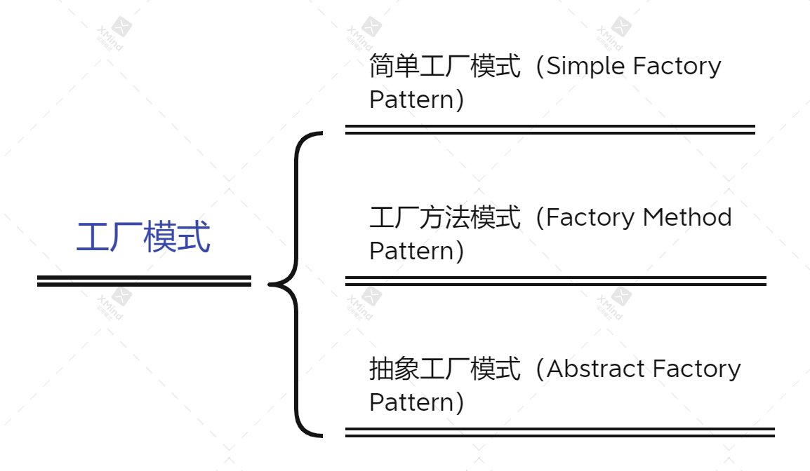
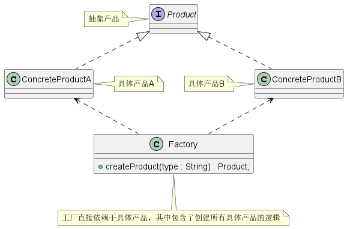
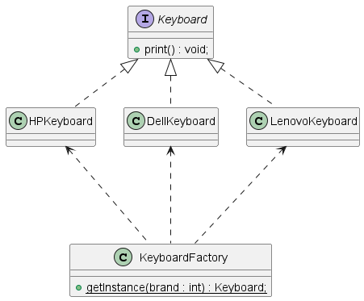
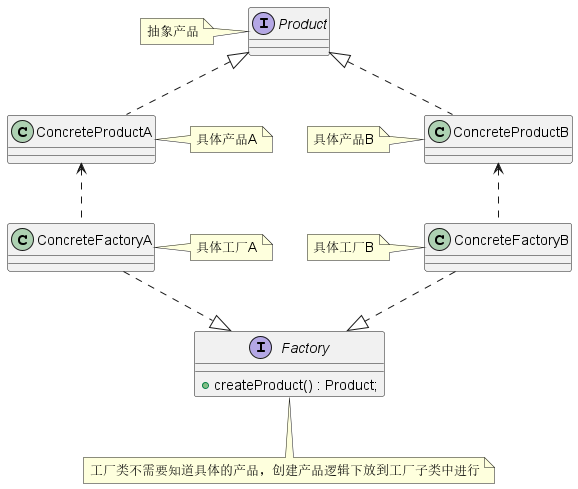
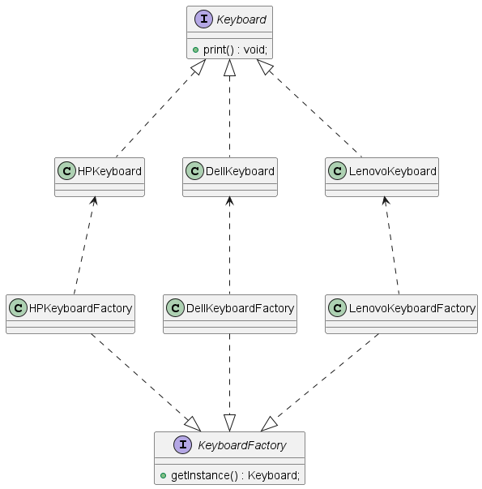
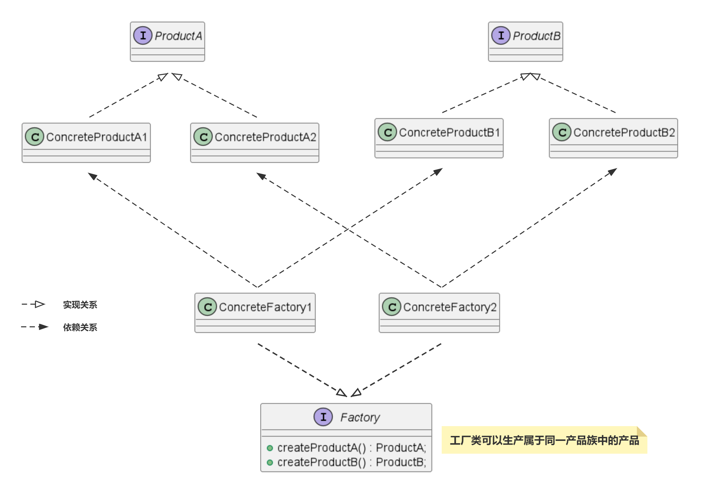
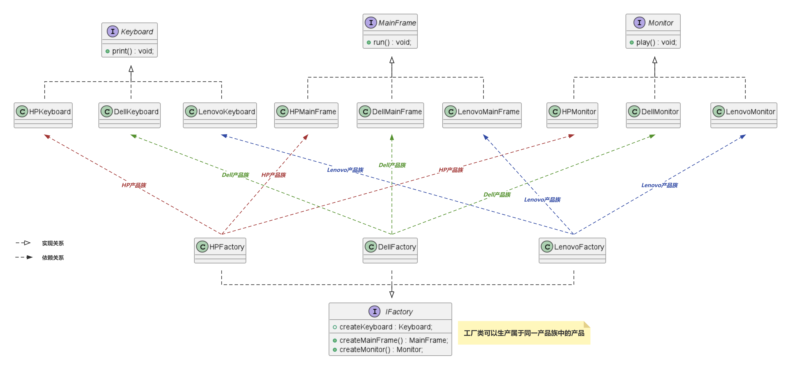

在我们平常创建对象时，都是通过关键字 `new` 来实现的，比如说 `A a = new A()`。但是在某些情况下，要创建的对象需要经过一系列复杂的初始化操作，比如查配置文件、查数据库表、初始化成员对象等，如果将这些逻辑全部放到构造函数中，会极大影响代码的可读性。这时候我们就可以单独定义一个类来负责对象的创建，这样的类就是工厂类，这种做法就是**工厂模式**，在任何需要生成复杂对象的地方，都可以使用工厂模式。

> **工厂模式（Factory Pattern）**属于创建型模式，它提供了一种创建对象的最佳方式。其核心思想就是把创建对象和使用对象解耦，由工厂负责对象的创建，而用户只能通过接口来使用对象，这样就可以灵活应对变化的业务需求，方便代码管理，避免代码重复。

工厂模式主要包括：**简单工厂模式（Simple Factory Pattern）**、**工厂方法模式（Factory Method Pattern）** 和 **抽象工厂模式（Abstract Factory Pattern）**三种。



# 简单工厂模式

顾名思义，**简单工厂模式（Simple Factory Pattern）**是最简单的一种工厂模式，它定义了一个负责生产对象的工厂类，使用者可以根据不同的参数来创建返回不同子类，这些子类都共用一个接口。

在简单工厂中主要包含三个概念：*抽象产品*、*具体产品* 以及 *工厂*。

| 概念       | 关系                             | 作用                                 |
| ---------- | -------------------------------- | ------------------------------------ |
| *抽象产品* | 具体产品的父类                   | 描述产品的公共接口                   |
| *具体产品* | 抽象产品的子类；工厂创建的目标类 | 描述生产的具体产品                   |
| *工厂*     | 供其他模块调用                   | 根据传入的参数来创建不同具体产品实例 |



## 代码示例

比如说，我们在采购键盘时，有惠普、戴尔和联想三种生产厂家，如果按照简单工厂模式来实现键盘生产，如下所示（[完整代码](../../creational-pattern/simple-factory/src/main/java/com/github/kokasumi)）：



```java
public interface Keyboard {
    void print();
}

public class DellKeyboard implements Keyboard{
    // 省略实现...
}

public class HPKeyboard implements Keyboard{
    // 省略实现...
}

public class LenovoKeyboard implements Keyboard{
    // 省略实现...
}

public class KeyboardFactory {
    /**
     * 根据类型选择创建键盘
     * @param brand
     * @return
     */
    public static Keyboard getInstance(int brand) {
        if(BrandEnum.HP.getCode() == brand) {
            return new HPKeyboard();
        }else if(BrandEnum.DELL.getCode() == brand) {
            return new DellKeyboard();
        }else if(BrandEnum.LENOVO.getCode() == brand) {
            return new LenovoKeyboard();
        }
        return null;
    }
}
```

## 优缺点

**优点：**

1. 将对象的使用和创建过程分离开，实现解耦。客户端不需要关注对象是谁创建的、怎么创建的，只需要通过工厂中的静态方法就可以直接获取所需对象。
2. 由于工厂方法是静态方法，使用起来很方便，可以通过类名直接调用，只需要传入一个简单的参数即可。

**缺点：**

1. 系统扩展困难，一旦添加新产品就必须对工厂中的选择逻辑进行修改，在产品类型过多时，有可能造成工厂逻辑多余复杂，不利于系统的扩展和维护。
2. 工厂类集合了所有产品的创建逻辑，一旦工厂类不能正常工作，整个系统都会受到影响。
3. 静态方法不能被继承和重写，会造成工厂角色无法形成基于继承的等级结构。

## 适用场景

1. 具体产品类较少时，使用简单工厂模式可以实现生产者和消费者的分离，而且也不会在工厂类中设定太复杂的判断逻辑。
2. 使用者只知道传入工厂类的参数，不关心如何创建对象的逻辑时。

# 工厂方法模式

**工厂方法模式（Factory Method Pattern）** 是一种创建型设计模式，它定义一个创建对象的接口，让实现这个接口的类来决定实例化对象的具体类型。工厂方法让类的实例化推迟到子类中进行。

工厂方法模式主要包含四个概念：*抽象产品*、*具体产品*、*抽象工厂* 以及 *具体工厂*，它是在简单工厂的基础上，定义一个抽象工厂类，然后将创建产品的工作分散推迟到具体工厂中进行。

| 概念       | 关系                             | 作用                               |
| ---------- | -------------------------------- | ---------------------------------- |
| *抽象产品* | 具体产品的父类                   | 描述产品的公共接口                 |
| *具体产品* | 抽象产品的子类；工厂创建的目标类 | 描述生产的具体产品                 |
| *抽象工厂* | 具体工厂的父类                   | 描述创建产品的公共接口             |
| 具体工厂   | 抽象工厂的子类，供其他模块调用   | 实现抽象工厂接口，创建具体产品实例 |



## 代码示例

如果我们使用工厂方法模式来实现键盘生产，我们可以按照以下设计方案实现（[完整代码](../../creational-pattern/factory-method/src/main/java/com/github/kokasumi)）：




```java
public interface Keyboard {
    void print();
}

public class DellKeyboard implements Keyboard{
    // 省略实现...
}

public class HPKeyboard implements Keyboard{
    // 省略实现...
}

public class LenovoKeyboard implements Keyboard{
    // 省略实现...
}

public interface KeyboardFactory {
    Keyboard getInstance();
}

public class DellKeyboardFactory implements KeyboardFactory{
    // 省略实现...
}

public class HPKeyboardFactory implements KeyboardFactory{
    // 省略实现...
}

public class LenovoKeyboardFactory implements KeyboardFactory{
    // 省略实现...
}
```

## 优缺点

**优点：**

1. 符合开闭原则，系统的扩展性很好。在需要引入新产品时，无需修改抽象工厂和抽象产品提供的接口，也无需修改客户端调用，不会影响到其他具体产品和具体工厂，只需要添加新的具体产品和生产工厂子类即可。
2. 符合单一职责原则。每个具体工厂只负责创建对应的具体产品即可，无需了解创建其他产品子类。
3. 相比于简单工厂模式，抽象工厂可形成继承的等级结构。

**缺点：**

1. 一个具体工厂只能创建一种具体产品。添加新产品时，除增加新产品类之外，还需要提供与之对应的具体工厂类，类的个数成倍增加，在一定程度上增加了系统复杂度；同时有更多的类需要编译和运行，增加了系统的额外开销。
2. 考虑到系统的可扩展性，引入了工厂抽象层，在客户端代码中均需要使用抽象层进行定义，增加了系统的抽象性和理解难度，且在实现时可能需要用到DOM、反射等技术，增加了系统的实现难度。

## 适用场景

1. **当我们在编写代码的过程中，如果无法预知对象的确切类型及其依赖关系时，可使用工厂方法模式。**工厂方法将创建产品的代码与实际使用产品的代码分离，从而能在不影响其他代码的情况下扩展产品创建部分代码。
2. **一个类希望由它的子类来指定它所创建的对象，获得更高的扩展性，可以使用工厂方法模式**。在工厂方法模式中，对于抽象工厂类只需要提供一个创建产品的接口，而由其子类来确定具体要创建的对象，利用面向对象的多态性和里氏代换原则，在程序运行时，子类对象将覆盖父类对象，从而使得系统更容易扩展。
3. 将创建对象的任务委托给多个工厂子类中的某一个，调用者在使用时可以无需关心是哪个工厂子类创建产品，需要时动态指定，可将具体工厂类的类名存储在配置文件或数据库中。

# 抽象工厂模式

工厂方法模式通过引入工厂等级结构，解决了简单工厂模式中工厂职责太重的问题，但由于工厂方法模式中的每个工厂类只生产一类产品，可能会导致系统中存在大量的工厂类，势必会增加系统的开销。因此，我们可以考虑**将一些相关的产品抽象成一个“产品族”，由同一个工厂来统一生产**，这就是抽象工厂模式的基本思想。

**抽象工厂模式（Abstract Factory Pattern）** 提供一个创建一系列相关或相互依赖对象的接口，无须指定它们具体的类型。抽象工厂模式又被称为 Kit 模式，属于对象创建型模式。抽象工厂模式与工厂方法模式最大的区别在于：抽象工厂中的每个具体工厂可以创建多个具体产品；但是工厂方法每个具体工厂只能创建一类具体产品。

抽象工厂模式主要包含五个概念：*抽象产品族*、*抽象产品*、*具体产品*、*抽象工厂* 和 *具体工厂*，它是在工厂方法的基础上，将多种产品抽象成一个产品族，每个工厂都可以生产一个产品族的产品。

| 概念         | 关系                             | 作用                                     |
| ------------ | -------------------------------- | ---------------------------------------- |
| *抽象产品族* | 一组相关的抽象产品               | 将相关或相互依赖的产品封装到一个抽象工厂 |
| *抽象产品*   | 具体产品的父类                   | 描述产品的公共接口                       |
| *具体产品*   | 抽象产品的子类；工厂创建的目标类 | 描述生产的具体产品                       |
| *抽象工厂*   | 具体工厂的父类                   | 描述创建产品的公共接口                   |
| 具体工厂     | 抽象工厂的子类，供其他模块调用   | 实现抽象工厂接口，创建具体产品实例       |



## 代码示例

在我们现实生活中，惠普、戴尔和联想三家厂商，除了能够生产键盘以外，还可以生产显示器和主机。如果按照工厂方法模式去实现，显示器和主机分别有各自的工厂类去生产，这样会导致类的数量成倍剧增，因此我们可以考虑按照品牌来进行分组，同一工厂可以同时生产键盘、显示器和主机。如下 UML 图为设计实现方案（[完整代码](../../creational-pattern/abstract-factory/src/main/java/com/github/kokasumi)）：



```java
public interface Keyboard {
    void print();
}

public class DellKeyboard implements Keyboard{
    // 省略实现...
}

public interface Monitor {
    void play();
}

public class DellMonitor implements Monitor{
    // 省略实现...
}

public interface MainFrame {
    void run();
}

public class DellMainFrame implements MainFrame{
    // 省略实现...
}

public interface IFactory {
    MainFrame createMainFrame();
    Monitor createMonitor();
    Keyboard createKeyboard();
}

public class DellFactory implements IFactory{
    // 省略实现...
}

// 省略HP、Lenovo实现...
```

## 优缺点

**优点：**

1. **降低耦合度**。抽象工厂模式将具体产品的创建延迟到具体工厂类中，这样将对象的创建封装起来，可以减少客户端与具体产品类之间的依赖，从而降低系统耦合度，有利于后期的维护和扩展。
2. **符合开闭原则**。新增一种产品类时，只需要增加相应的具体产品和工厂子类即可，简单工厂模式需要修改工厂类的判断逻辑。
3. **符合单一职责原则**。每个具体工厂类只负责创建对应的产品，简单工厂模式中的工厂类需要进行复杂的 switch 逻辑判断。
4. 不使用静态工厂方法，可以形成基于继承的等级结构。
5. 可以确保同一工厂生成的产品相互匹配。

**缺点：**

1. 产品族扩展很困难，如果需要在产品族中添加新产品，就需要在抽象工厂中添加相应的产品，所有具体工厂类都会收到影响。
2. 采用抽象工厂模式需要向应用中引入众多的接口和类，代码可能会比之前更加复杂。

## 适用场景

1. **如果代码需要与多个不同系列的相关产品交互，但是由于无法提前获取相关信息，或者出于对未来扩展性的考虑，你不希望代码基于产品的具体类型进行构建，在这种情况下可以使用抽象工厂**。抽象工厂提供了接口，可用于创建每个系列的产品对象。只要代码通过该接口创建对象，就不会生成与应用程序已有产品类型不一致的产品。
2. **如果你有一个基于一组抽象方法的类，其主要功能因此变得不明确，那么在这种情况下可以考虑使用抽象工厂模式**。在设计良好的程序中，每个类只负责一件事。如果一个类与多种类型产品交互，就可以考虑将工厂方法抽取到独立的工厂类或具备完整功能的抽象工厂类中。

# 总结

**简单工厂模式**：定义了一个负责生产对象的工厂类，使用者可以根据不同的参数来创建返回不同产品。简单工厂模式没有考虑后期的维护和扩展，修改违背开闭原则，静态方法不能形成继承的层级结构。

**工厂方法模式**：主要思想是继承，在简单工厂的基础上，定义一个抽象工厂类，然后将创建产品的工作分散推迟到具体工厂中进行。工厂方法模式修改符合开闭原则，但每个工厂只能创建一种产品。

**抽象工厂模式**：主要思想是组合，在工厂方法的基础上，将相关或依赖的产品抽象成 “产品族” ，由同一个工厂来统一生产。抽象工厂修改符合开闭原则，但只适用于增加同类工厂这种横向扩展，不适合新增产品这种纵向扩展。

# 参考资料

1. [简单工厂模式、工厂方法模式和抽象工厂模式有何区别？](https://www.zhihu.com/question/27125796)
2. [工厂设计模式有什么用？](https://www.zhihu.com/question/24843188/answer/2690577309)
3. [工厂方法模式](https://refactoringguru.cn/design-patterns/factory-method)
4. [抽象工厂模式](https://refactoringguru.cn/design-patterns/abstract-factory)
5. [工厂模式——这一篇真够了](https://xie.infoq.cn/article/88c926822394aa1c80847dd2a)


