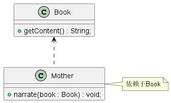
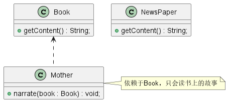
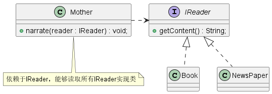

# 什么是依赖倒置原则？

在面向对象编程领域中，**依赖倒置原则** (Dependency Inversion Principle，DIP)是指一种特定的解耦形式，使得高层次的模块不依赖于低层次模块的实现细节，依赖关系被倒置，从而使得低层次模块依赖于高层次模块的需求抽象。其原始定义为：

> *Hive level modules should not depend upon low level modules. Both should depend upon abstraction. Abstraction should not depend upon details. Details should depend upon abstractions.*

依赖倒置原则规定：

- 高层模块不应该依赖于低层模块，两者都应该依赖于抽象接口
- 抽象接口不应该依赖于具体实现，而具体实现应该依赖于抽象接口

# 如何理解倒置？

在传统的应用程序软件架构中，高层组件总是会依赖于低层组件，从而构建越来越复杂的系统。也就是说，我们必须先设计实现低层组件，然后才能实现高层组件，高层组件对低层组件具有依赖性。这样会导致高层组件与低层组件的耦合度过高，低层组件一旦发生变化，就必须重新设计高层组件。


依赖倒置原则需要低层组件提供足够抽象、通用的抽象层供高层组件使用，在设计抽象层时需要考虑到高层组件的使用场景和功能，抽象层也同样作为低层组件的设计规范。也就是说，低层组件的设计需要根据高层组件的使用场景和功能来考虑，这就是一种倒置关系。


**总结来说，在我们传统的软件架构中，高层组件依赖于低层组件来设计实现；通过依赖倒置原则，首先需要根据高层组件的使用场景和功能来设计抽象层，然后通过抽象层约束低层组件的设计实现，这是一种倒置关系。**

# 场景示例

我们举一个例子来说明依赖倒置原则的应用，比如说，每天晚上妈妈都会读故事书哄女儿睡觉，那么我们可以设计如下实现这个功能：



```java
public class Book {
    public String getContent() {
        return "在三个兄弟鼠的院子里，有一口大缸，里面盛满了水...";
    }
}

public class Mother {
    /**
     * 讲故事
     * @param book
     */
    public void narrate(Book book) {
        System.out.println("妈妈开始讲故事");
        System.out.println(book.getContent());
    }
}
```

这样能够实现功能，妈妈照着童话书就可以讲故事哄女儿睡觉。但是如果有一天，妈妈手里没有了童话书，只有一份报纸，需要妈妈读报纸上的故事哄女儿睡觉，报纸的代码如下：

```java
public class NewsPaper {
    public String getContent() {
        return "林书豪38+7领导尼克斯击败湖人...";
    }
}
```



按照上面的设计，妈妈拿到报纸，发现她无法读取报纸上的故事，但是在现实生活中不可能只能读取故事书却无法读取报纸，这样的设计是不合理的。因为 `Mother` 与 `Book` 之间的耦合度太高了，导致将 `Book` 换成 `NewsPaper` 后 `Mother` 就无法正常讲故事，因此我们需要降低 `Mother` 与 `Book` 之间的耦合度。

---

想要降低 `Mother` 和 `Book` 之间的耦合度，我们可以抽象出一个接口 `IReader` ，用于表示带文字的读物。 `Mother` 依赖于 `IReader` ，`Book` 和 `NewsPaper` 都属于读物的范畴，因此他们都需要各自实现 `IReader` 接口，这样妈妈就能够读取任何带文字的事物，符合现实世界业务逻辑。



```java
public interface IReader {
    /**
     * 获取内容
     * @return
     */
    String getContent();
}

public class Book implements IReader{
    @Override
    public String getContent() {
        return "在三个兄弟鼠的院子里，有一口大缸，里面盛满了水...";
    }
}

public class NewsPaper implements IReader{
    @Override
    public String getContent() {
        return "林书豪38+7领导尼克斯击败湖人...";
    }
}

public class Mother {
    /**
     * 讲故事
     * @param reader
     */
    public void narrate(IReader reader) {
        System.out.println("妈妈开始讲故事");
        System.out.println(reader.getContent());
    }
}
```

具体代码实现可见[依赖倒置原则实现代码](../../design-principle/solid-dip)

# 依赖的三种实现方式

## 构造函数注入

```java
public class Mother {
    private IReader reader;
    
    /**
    * 构造函数注入依赖：通过构造函数传递依赖对象
    */
    public Mother(IReader reader) {
        this.reader = reader;
    }
    
    public void narrate() {
        System.out.println("妈妈开始讲故事");
        System.out.println(reader.getContent());
    }
}
```

## Setter注入依赖

```java
public class Mother {
    private IReader reader;
    
    /**
    * Setter注入依赖：通过Setter方法传递依赖对象
    */
    public void setReader(IReader reader) {
        this.reader = reader;
    }
    
    public void narrate() {
        System.out.println("妈妈开始讲故事");
        System.out.println(reader.getContent());
    }
}
```

## 方法注入依赖

```java
public class Mother {
    /**
     * 方法注入依赖：在方法参数中声明依赖对象
     * @param reader
     */
    public void narrate(IReader reader) {
        System.out.println("妈妈开始讲故事");
        System.out.println(reader.getContent());
    }
}
```

# 总结

依赖倒置原则的本质就是通过抽象使各个类或模块的实现彼此独立，不互相影响，实现模块间的松耦合。在项目中，我们可以遵循以下规则实现依赖倒置原则：

- 低层模块尽量都要有抽象类或接口，或者两者都有。
- 变量的声明类型尽量是抽象类或接口。
- 使用继承时遵循里氏替换原则。 依赖倒置原则的核心就是要我们面向接口编程，理解了面向接口编程，也就理解了依赖倒置。
- 开发情况下任何类都不应该从具体类派生，项目维护时不需要考虑这个规则

*接口负责定义 `public ` 属性和方法，并且声明与其他对象的依赖关系；抽象类负责公共构造部分的实现；实现类准确的实现业务逻辑，同时在适当时候对父类进行细化。*

# 参考资料

1. 《设计模式之禅》第3章 依赖倒置原则
2. [Dependency inversion principle](https://en.wikipedia.org/wiki/Dependency_inversion_principle)
3. [依赖倒置原则(Dependence Inversion Principle)](https://wizardforcel.gitbooks.io/design-pattern-lessons/content/lesson4.html)
4. [依赖倒置原则的“倒置”体现在哪里，”依赖倒置“为什么不叫”依赖转移“而叫”倒置“（高人勿入）](https://q.cnblogs.com/q/72496/)

