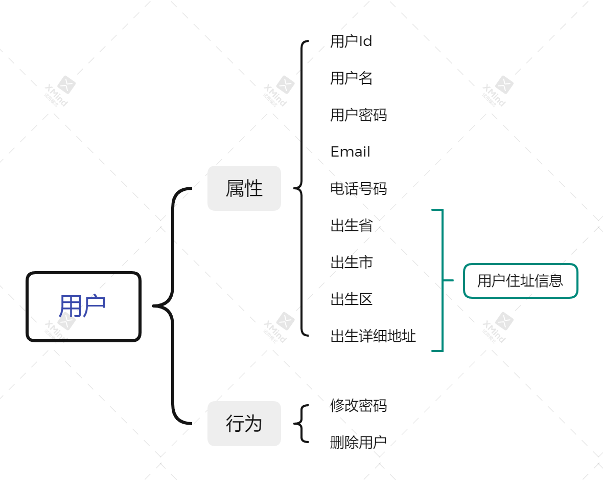
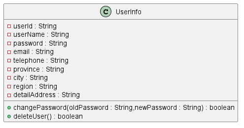
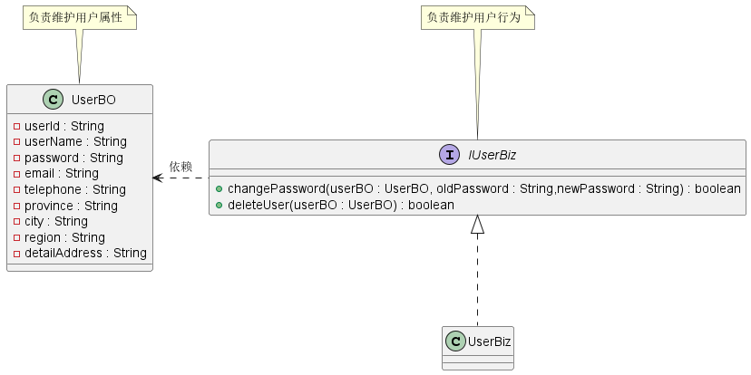
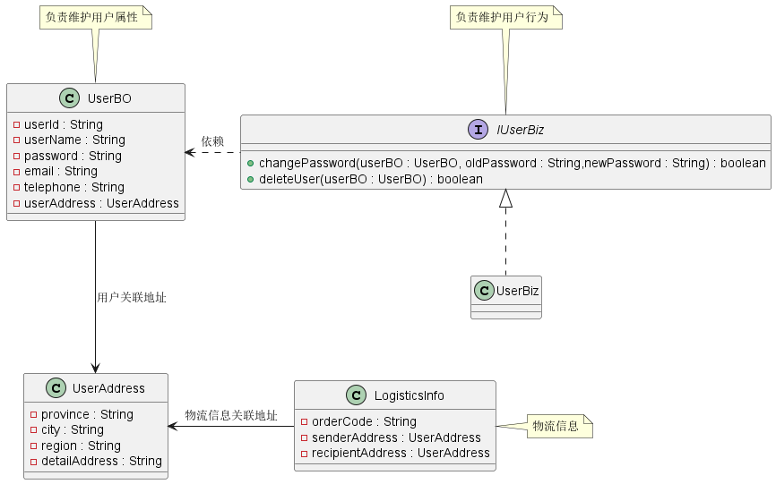
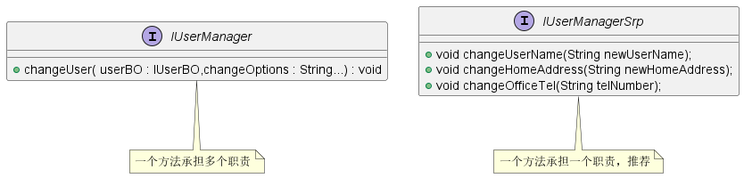

在程序设计领域，存在五个面向对象编程设计的基本原则，遵循这些基本原则更容易开发出易维护、易扩展的系统。**SOLID** 就是这五个基本原则的首字母缩写，这五个基本原则分别是：

- 单一职责原则（S）
- 开闭原则（O）
- 里氏替换原则（L）
- 接口隔离原则（I）
- 依赖反转原则（D）

我们今天就先来介绍一个 **SOLID** 设计原则中的 单一职责原则（S）。

# 什么是单一职责原则？

**单一职责原则** 的英文表示为 *Single Responsibility Principle* ，缩写为 **SRP**。其原始定义如下：

> *A class or module should have a single responsibility.*
>
> *一个类或模块只负责完成一个职责或功能。*

所谓的职责就是引起类或模块变化的原因。如果一个类或模块有多个原因引起改变，那么这个类或模块就不符合单一职责原则。

# 为什么需要单一职责原则？

**问题**：如果类 A 负责两个职责：职责 P1 和 P2。如果 P1 需求发生变化时，需要修改类 A ，那么就有可能导致原本运行正常的 P2 功能发生故障。

**解决方案**：从问题描述可知，如果一个类负责了多个职责，这些职责耦合在了一起，那么无论哪个职责发生变化都有可能对另外的职责行为产生影响。因此，我们可以遵循 单一职责原则 进行设计，每个类都只负责一项职责，这样的话无论哪项职责发生变化都不会对另一职责产生影响。

正确使用 单一职责原则 具有以下优点：

- 降低类的复杂度，一个类只负责一项职责，逻辑肯定比负责多项职责要简单
- 提高类的可读性，提高系统的可维护性
- 降低变更带来的风险。在开发过程中，需求变更是不可避免的，如果设计遵循 单一职责原则，当修改一个功能点时，能够显著降低对其他功能的影响。

# 怎么设计一个单一职责的类？

**问题描述**：在我们项目开发中，经常会使用到用户管理，用户有很多的信息和行为需要维护，比如说修改用户信息、删除用户等功能。那么我们应该如何设计一个符合 *单一职责原则* 的类呢？

# 不符合单一职责原则设计

首先我们考虑一种最简单的设计，将所有用户的信息和行为都放到同一个类中。设计如下所示：

代码设计可在[UserInfo简单设计](../../design-principle/solid-srp/src/main/java/com/github/kokasumi/neg/UserInfo.java)查看。

# 符合单一职责原则设计

上面的设计比较简单，将所有的用户信息都封装到 `UserInfo` 类中，没有遵守一职责原则，那么无论是属性还是用户行为发生变化都会对 `UserInfo` 进行修改，在业务比较复杂的时候可能会相互影响导致出现故障。

我门可以使用单一职责原则对类进行重新设计，使得用户属性和行为的维护分开，以此来隔离属性和行为之间的相互影响，设计类图如下所示：

符合单一职责原则的用户设计代码示例可见[符合单一职责原则设计的User设计](../../design-principle/solid-srp/src/main/java/com/github/kokasumi/pos)。

# 更进一步思考

我们按照上述符合单一职责原则设计，那么这种设计是否就真的符合单一职责原则呢？我们可以从另一种场景进行思考，如果我们的应用系统是电商系统，那么 `UserBO` 中的地址信息是否符合单一职责原则呢？

如果我们的系统是电商系统，那么必然会有物流信息产生，那么 `UserBO` 中的用户住址除了用于展示外，还可能会用于物流地址信息，那么 `UserBO` 中的地址信息就会涉及到两种职责，违反了单一职责原则，我们就可以将地址信息从 `UserBO` 中独立出来。

将地址信息抽离的代码示例可见[地址信息独立设计](../../design-principle/solid-srp/src/main/java/com/github/kokasumi/future)。

从上面的示例场景中，我们发现不同的应用场景、不同阶段的需求背景下，对于同一个类的设计考虑的职责边界是不一样的。并且在软件开发设计过程中，考虑方面越多，类的数据会剧增，类之间的交互也会很复杂。因此**我们在进行类或接口设计时，需要根据当前业务场景在单一职责原则和设计复杂度之间做一个折中，不要为了刻意达到单一职责原则而过大的增加系统设计复杂度。**

# 总结

单一职责原则给我们的系统设计带来了一些好处：类的复杂性降低；可维护性提高；变更引起的风险降低。但同时在遵循单一职责原则的同时，也给我们的系统设计带来了一些复杂性，因此我们不要过度依赖单一职责原则。

**对于接口，我们在设计时一定要遵循单一职责原则，但是对于实现类就需要多方面考虑了。生搬硬套单一职责原则会引起类的剧增，维护非常麻烦，而且过分细分类的职责也会人为增加系统的复杂性。**

对于接口、类之外，单一职责原则也同样适用于方法，也就是说一个方法尽可能只做一件事情。比如说，修改用户密码，不要把其和修改用户信息放到一个方法中实现，尽量做到每个方法只做一件事情。

# 参考资料

1. 《设计模式之禅》第1章 单一职责原则
2. [《软件修养 -- 单一职责原则（SRP：Single responsibility principle）》](https://link.juejin.cn/?target=https%3A%2F%2Fmakeoptim.com%2Ftraining%2Fsingle-responsibility-principle)
3. 《设计模式之美 - 王争》 理论一：对于单一职责原则，如何判定某个类的职责是否够“单一”？