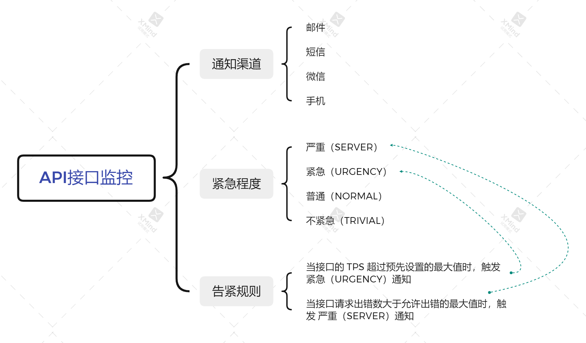
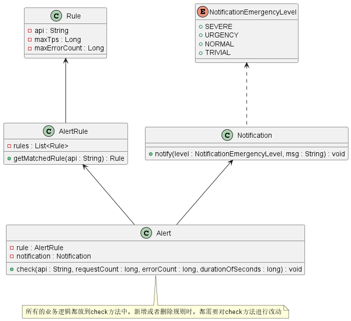
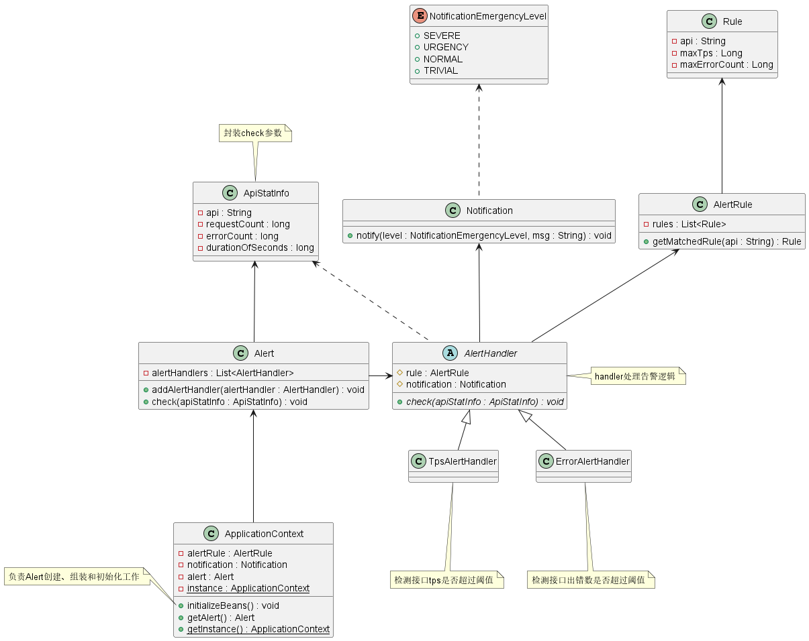

# 什么是开闭原则？

**开闭原则** 的英文全称是 *The Open/Closed Principle*，缩写为 **OCP**。其原始定义为：

> *Software entities like classes, modules and functions should be open for extension but closed for modifications.*
>
> *软件中的对象（如类、模块、函数等）应该对扩展开放，对修改关闭。*

开闭原则 意味着一个实体应该通过扩展来实现行为变化，而不是通过修改已有代码来实现变化。该特性在产品化的环境中是特别有价值的，在这种环境中，改变源代码需要代码审查、单元测试等用于确保产品使用品质的过程，遵循开闭原则可以在实现需求行为变更的同时无需重复以上过程。

# 为什么需要开闭原则？

**问题**：在软件的生命周期中，因为变化、升级和维护等原因需要对软件原有代码进行修改时，可能会给旧代码中引入错误，也可能会使我们对整个功能进行重构，并且修改的代码需要重新经过代码审查、单元测试等过程用以确保产品稳定性。

**解决方案**：从问题描述可知，修改已有代码会破坏产品的稳定性。如果我们在需求变化时，尽量通过扩展软件实体的行为来实现变化，而不是通过修改已有代码来实现，那我们就可以尽可能的在实现变化的同时保证已有代码的稳定性。

正确使用 *开闭原则* 具有以下优点：

- 对软件测试的影响：开闭原则 可以保持原有的代码的稳定性，我们只需要对扩展代码进行测试就可以了
- 提高代码的可复用性：代码的粒度越小，可复用性也就越高
- 提高软件可维护性：遵守 开闭原则 的软件，其稳定性和延续性较强，从而更易于扩展和维护。

# 怎么理解开闭原则？

开闭原则 是面向对象设计中最基础的设计原则，它指导我们如何建立稳定灵活的系统。同时 开闭原则 也是很模糊的一个原则，它只是定义了一个指导原则：“通过扩展而不是修改来实现变化”，但是并没有明确的告诉我们该如何去实现 开闭原则。

虽然 开闭原则 并没有明确告诉我们该如何实现，但是可以确定的一点是，只要我们在设计时遵循了其他设计原则，那么设计出来的软件自然就是符合开闭原则的。换句话说，**开闭原则 提供了一个设计稳定灵活系统的指导原则，而其他设计原则描述了实现开闭原则的细节。**

按照经验理解，开闭原则无非是想表达这样一层意思：**用抽象构建框架，用实现扩展细节**。因为抽象灵活性好，适应性广，只要抽象的合理，基本可以保持软件架构的稳定性。而软件中易变的细节，我们可以从抽象派生的实现类来进行扩展，当软件需求发生变更时，我们只需要根据需求重新派生一个实现类来扩展就可以了。

## 问题描述

下面我们通过一个问题来进一步理解 开闭原则：

**问题描述**：在我们软件开发中，可能会遇到API接口监控告警的需求。在系统中，我们可以设置不同的监控指标，然后在API监控达到相应告警指标时，根据不同的紧急程序选择相应的通知渠道下发消息。

- API监控告警紧急程度可分为：严重（SERVER）、紧急（URGENCY）、普通（NORMAL）、不紧急（TRIVIAL）
- 通知渠道分为：邮件、短信、微信、手机等。
- 当接口的 TPS 超过预先设置的最大值时，触发 紧急（URGENCY）通知；当接口请求出错数大于允许出错的最大值时，触发 严重（SERVER）通知



## 不遵守开闭原则设计



```java
/**
* 检测告警规则，所有的业务逻辑都放到check方法中
*/
public void check(String api, long requestCount, long errorCount, long durationOfSeconds) {
    // 检测接口tps是否超过阈值
    long tps = requestCount / durationOfSeconds;
    if (tps > rule.getMatchedRule(api).getMaxTps()) {
        notification.notify(NotificationEmergencyLevel.URGENCY, "...");
    }
    // 检测接口出错数是否超过阈值
    if (errorCount > rule.getMatchedRule(api).getMaxErrorCount()) {
        notification.notify(NotificationEmergencyLevel.SEVERE, "...");
    }
}
```

这种设计非常简单，所有的告警通知检测都写在 `check()` 方法内部，当接口的 TPS 超过指定阈值，或者接口出错数超过指定阈值，都会触发告警，通知接口相关负责人或团队。

但是这种设计存在一个问题，比如说，现在我们需要添加一种告警规则：当每秒接口超时请求个数超过设置的最大阈值时，我们也需要触发告警通知信息。这个时候，我们需要修改两处来添加此告警规则：

1. 修改 `check()` 入参，添加一个新的统计数据参数 `timeoutCount`，表示超时接口请求数；
2. 修改 `check()` 函数内部逻辑，添加新的告警规则。

```java
/**
* 新增告警规则：
* 1.新增参数timeoutCount
* 2.添加接口超时处理逻辑
*/
public void check(String api, long requestCount, long errorCount, long timeoutCount, long durationOfSeconds){
    //... 省略，与上面check方法一致
    // 添加接口超时处理逻辑
    long timeoutTps = timeoutCount / durationOfSeconds;
    if (timeoutTps > rule.getMatchedRule(api).getMaxTimeoutTps()) {
        notification.notify(NotificationEmergencyLevel.URGENCY, "...");
    }
}
```

上面的设计改动能够满足需求，但是会存在一些问题：

- 对函数参数进行了调整，那么所有调用函数的地方都需要做相应的修改。
- 所有的检测告警规则逻辑都冗余在同一个方法中，也就意味着新增或者删除一种规则，都需要对相应的单元测试进行改动，可能会对测试过的逻辑产生影响。

具体代码可见[Alert不遵守开闭原则设计](../../design-principle/solid-ocp/src/main/java/com/github/kokasumi/neg)

## 遵守开闭原则设计

上面的设计是基于代码修改的方法来实现新功能的，这种方式存在很多弊端。如果我们遵守开闭原则，那么如何通过扩展的方式来实现相同的功能呢？

从上面分析可知，`Alert` 类设计不符合开闭原则，因为在添加告警规则时需要修改 `check()` 函数方法参数及内部实现逻辑。因此我们可以通过以下两部分改造来使得 `Alert` 类的代码扩展性更好：

- 参数方面：将 `check()` 函数的多个入参封装成实体类；
- 实现逻辑：引入 `handler` 的概念，将 `if` 判断逻辑分散在各个 `handler` 中。



上述设计使用 *开闭原则* 实现了API接口监控，如果我们想要扩展监控规则：当每秒接口超时请求个数超过设置的最大阈值时，我们也需要触发告警通知信息，可以通过以下几步达到目的：

1. 在 `ApiStatInfo` 类中添加新的属性 `timeoutCount`
2. 添加新的 `TimeoutAlertHander` 类，用于判断处理每秒接口超时个数超过最大阈值的处理逻辑
3. 在 `ApplicationContext#initializeBeans()` 方法中，给 `alert` 对象注册新的 `timeoutAlertHandler`

```java
public class ApiStatInfo {
    private String api;
    private long requestCount;
    private long errorCount;
    private long durationOfSeconds;
    // 1.添加新字段
    private long timeoutCount;
}

// 2.添加新的handler
public class TimeoutAlertHandler extends AlertHandler {
}

public class ApplicationContext {
    // ...省略其他

    public void initializeBeans() {
        // ...省略其他代码
        // 3.注册handler
        alert.addAlertHandler(new TimeoutAlertHandler(alertRule, notification));
    }
}
```

具体实现代码可见[Alert遵守开闭原则设计](../../design-principle/solid-ocp/src/main/java/com/github/kokasumi/pos)

# 总结

**开闭原则是一种思想，没有具体实际操作方法，其他的设计原则是为了实现开闭原则提供的一些实现方法。也就是说，只要遵循了其他设计原则，设计出来的软件自然是符合开闭原则的。** 单一职责告诉我们实现类职责要单一；里氏替换原则告诉我们不要破坏类继承体系；依赖倒置原则告诉我们要面向接口编程；接口隔离原则告诉我们在设计接口时要精简单一；迪米特法则告诉我们要降低耦合。开闭原则是总纲，它告诉我们要对扩展开放，对修改关闭。

# 参考资料

1. 《设计模式之禅》第6章 开闭原则
2. [软件修养 -- 开闭原则（OCP ：Open Closed Principle）](https://link.juejin.cn/?target=https%3A%2F%2Fmakeoptim.com%2Ftraining%2Fopen-closed-principle)
3. [设计模式六大原则（6）：开闭原则](https://link.juejin.cn/?target=https%3A%2F%2Fblog.csdn.net%2Fzhengzhb%2Farticle%2Fdetails%2F7296944)
4. 《设计模式之美 - 王争》 理论二：如何做到“对扩展开放、修改关闭”？扩展和修改各指什么？
5. [设计模式 ☞ 七大设计原则之开闭原则](https://link.juejin.cn/?target=https%3A%2F%2Fcloud.tencent.com%2Fdeveloper%2Farticle%2F1762919)