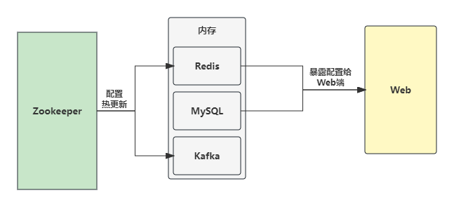
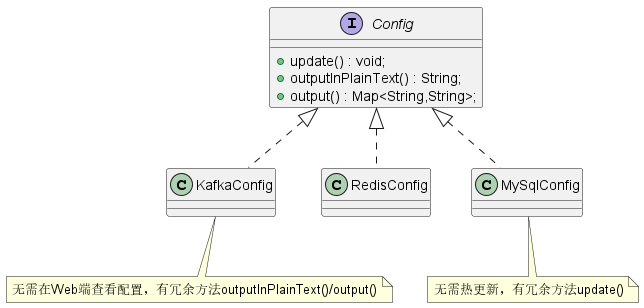
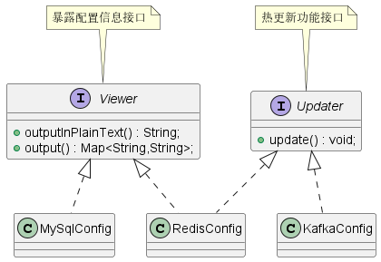

# 什么是接口隔离原则？

**接口隔离原则** 的英文全称为  *Interface Segregation Principle* ，缩写为 **ISP** 。它有两种原始定义：

> *Clients should not be forced to depend upon interfaces that they don't use.*
>
> *不应该强行要求客户端依赖它们不需要使用的接口。*
>
> *The dependency of one class to another one should depend on the smallest possible interface.*
>
> *类之间的依赖应该建立在最小的接口上。*

也就是说，接口隔离原则要求拆分庞大臃肿的接口成为更小或更具体的接口，以方便客户端集中精力到它们感兴趣的接口方法。接口隔离原则的目的是系统解耦，从而易于重构、更改和重新部署。这个原则指导我们在设计接口时需要注意以下几点：

- 一个类对另一个类的依赖应该建立在最小的接口之上；
- 建立多个单一接口，不要建立庞大臃肿的接口；
- 尽量细化接口，接口中的方法尽量少。但是要注意，并不是越少越好，在进行接口拆分时，首先必须满足单一职责原则。

# 怎么理解接口隔离原则？

## 场景示例



假设在我们的项目中使用到了 `Redis` 、`MySQL` 和 `Kafka` 三个外部组件，这三个组件有很多的系统配置信息（比如地址、端口、访问超时时间等）在 `Zookeeper` 中进行维护。针对这些组件的系统配置具有以下两个功能需求：

1. `Redis` 和 `Kafka` 配置信息需要热更新，也就是说在 `Zookeeper` 中更新 `Redis` 和 `Kafka` 信息配置时，需要能够及时更新到内存中。
2. 能够通过一个固定的 `HTTP` 地址访问 `MySQL` 和 `Redis` 配置信息。

通过分析可知，我们需要三个配置类将 `Zookeeper` 中的配置信息存储到内存中，这样才能够在应用程序中使用这些配置信息。

```java
public class RedisConfig {
    /** 配置中心（比如zookeeper）*/
    private ConfigSource configSource;
    private String address;
    private int timeout;
    private int maxTotal;
    // 其他配置...

    public RedisConfig(ConfigSource configSource) {
        this.configSource = configSource;
    }

    public String getAddress() {
        return address;
    }

    public int getTimeout() {
        return timeout;
    }

    public int getMaxTotal() {
        return maxTotal;
    }

    public void init() {
        // 从configSource加载配置到address/timeout/maxTotal
    }
}

public class KafkaConfig {
    // 省略，可参考RedisConfig
}

public class MySQLConfig {
    // 省略，可参考RedisConfig
}
```

具体代码可见[Redis、Kafka、MySQL配置类](../../design-principle/solid-isp/src/main/java/com/github/kokasumi/origin)。

## 不遵循接口隔离原则设计



```java
public interface Config {
    /**
     * 更新配置信息
     */
    void update();

    /**
     * 以字符串形式返回配置信息
     * @return
     */
    String outputInPlainText();

    /**
     * 以map形式返回配置信息
     * @return
     */
    Map<String,String> output();
}

public class KafkaConfig implements Config{
    // 实现省略...
}

public class RedisConfig implements Config{
    // 实现省略...
}

public class MySqlConfig implements Config{
    // 实现省略...
}
```

上面的接口设计中，`Config` 接口中包含两类不相关的功能，一类是热更新 `update()`，一类是暴露配置给 Web 端方法 `output()` 和`outputInPlainText()` 。从理论上说， `KafkaConfig` 只需要实现热更新功能， `MySqlConfig` 只需要将配置信息暴露给 Web 端。但是上面这种接口设计， `Config` 实现类全部都需要实现热更新和配置信息暴露功能；此外，如果需要在 `Config` 接口中添加新功能，所有的实现类都需要改动，因此这种接口设计是不合理的。

具体实现代码可见[不遵循接口隔离原则设计代码](../../design-principle/solid-isp/src/main/java/com/github/kokasumi/neg)

## 遵循接口隔离原则设计



```java
public interface Updater {
    /**
     * 更新配置信息
     */
    void update();
}

public interface Viewer {
    /**
     * 以字符串形式返回配置信息
     * @return
     */
    String outputInPlainText();

    /**
     * 以map形式返回配置信息
     * @return
     */
    Map<String,String> output();
}

public class KafkaConfig implements Updater{
    // 省略实现...
}

public class RedisConfig implements Updater,Viewer{
    // 省略实现...
}

public class MySqlConfig implements Viewer{
    // 省略实现...
}
```

通过 `Updater` 和 `Viewer` 两个接口将热更新和暴露配置功能分离开，这样的设计思路更加灵活、易扩展、易复用。因为两个接口职责更加单一，单一就意味着通用、复用性好，我们只需要关注实现各组件应有的功能。如果我们有新的需求，开发一个 Metrics 性能统计模块，并且希望 Metrics 也能在 Web 端进行展示，以方便查看，那么我们只需要实现 `Viewer` 接口即可。

```java
public class ApiMetrics implements Viewer {
    //...
}

public class DbMetrics implements Viewer {
    //...
}
```

具体实现代码可见[遵循接口隔离原则设计代码](../../design-principle/solid-isp/src/main/java/com/github/kokasumi/pos)

## 接口隔离原则与单一职责原则

从定义上来看，接口隔离原则与单一职责原则有些相似，其实两者是有区别的，主要体现在以下几个方面：

- 单一职责原则注重的是职责，而接口隔离原则注重对接口依赖的隔离；
- 单一职责原则主要是约束类，其次才是接口和方法，它针对的是程序中的实现和细节；
- 接口隔离原则主要约束接口，主要针对抽象和程序整体框架的构建。

# 总结

接口隔离原则是对接口的定义，同时也是对类的定义，接口和类尽量使用原子接口或原子类来组装。在实践中，我们可以根据以下几个规则来进行衡量：

- 接口尽量小，但是要有限度。对接口进行细化可以提高程序设计的灵活性，但是如果过小，则会造成接口数量剧增，使设计复杂化，因此一定要适度。
- 为依赖接口的类定制服务，只暴露调用类需要的方法，它不需要的方法则隐藏起来。只有专注为一个模块提供定制服务，才能建立最小的依赖关系。
- 提高内聚，减少对外交互，使接口用最少的方法完成最多的事情。
- 运用接口隔离原则，一定要适度，接口设计的过大或过小都不好。设计接口的时候，只有多花些实践去思考和筹划，才能准确地实践这一原则。

# 参考资源

1. 《设计模式之美 - 王争》 理论四：接口隔离原则有哪三种应用？原则中的“接口”该如何理解？
2. [接口隔离原则wiki](https://zh.wikipedia.org/wiki/接口隔离原则)
3. [软件架构设计原则之接口隔离原则](https://xie.infoq.cn/article/af6e137c8ece91f97ed9ee0c4)
4. 《设计模式之禅》第4章 接口隔离原则