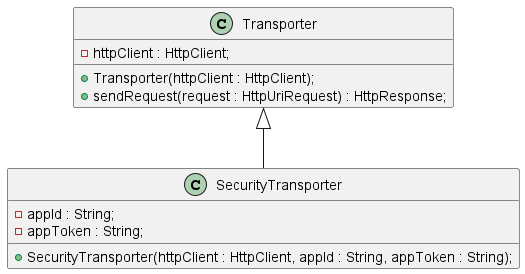

# 什么是里氏替换原则？

**里氏替换原则** 的英文全称是 *Liskov Substitution Principle*，缩写为 **LSP**。这个原则最早是在 1986 年由 Barbara Liskov 提出，他是这么描述这条原则的：

> *If S is a subtype of T, then objects of type T may be replaced with objects of type S, without breaking the program。*
>
> *如果 S 是 T 的子类型，那么所有 T 类型对象都可以在不破坏程序稳定性的情况下，使用 S 类型对象替换，*

在 1996 年，Robert Martin 在他的 SOLID 原则中，重新描述了这个原则：

> *Functions that use pointers or references to base classes must be able to use objects of derived classes without knowing it.*
>
> *所有引用基类的地方必须能透明地使用其子类的对象。*

综合两种描述，**里氏替换原则** 表达了这样一层含义：**在 *父类对象* 出现的任何地方都能够使用 *子类对象* 替换，并且能够保证原来程序的稳定性不被破坏。**

# 为什么使用里氏替换原则？

在面向对象语言中，继承是必不可少的、非常优秀的机制，它具有以下优点：

- 代码共享，减少创建类的工作量，每个子类都拥有父类的方法和属性；
- 提高代码的重用性；
- 提高代码的扩展性，子类不但拥有父类的所有功能，还可以添加自己的功能。

但是继承在带来便利的同时也会有一些缺点：

- 继承是侵入性的，只要继承，就必须拥有父类的所有属性和方法；
- 降低了代码的灵活性，因为继承时父类对子类会有一些约束；
- 增强了耦合性，当需要对父类进行修改时，就必须考虑对子类的影响，有时候修改一点代码都有可能进行大段的代码重构。

*里氏替换原则* 对继承进行了规则上的约束，遵循这些约束，可以在发扬继承优点的同时减少其带来的弊端。

# 怎么理解里氏替换原则？

里氏替换原则 的约束主要体现在以下4个方面：

1. 子类必须实现父类的抽象方法，但不能重写父类的非抽象方法；
2. 子类中可以增加自己的特有方法；
3. 当子类覆盖或实现父类的方法时，方法的前置条件（即方法输入参数）要比父类方法的输入参数更宽松；
4. 当子类的方法实现父类的方法时，方法的后置条件（即方法的输出/返回值）要比父类方法更严格或相等。

通俗的来说，里氏替换原则 就是 **子类可以扩展父类的功能，但不能改变父类原有的功能。**

## 场景示例

比如说，父类 `Transporter` 使用 `org.apache.http.HttpClient` 类来传输网络数据，子类 `SecurityTransporter` 继承父类 `Transporter`，重写 `sendRequest()` 方法，增加额外的功能，支持传输 `appId` 和 `appToken` 安全认证信息，如下图所示：



其中 `Transporter` 类代码设计如下所示：

```java
public class Transporter {
    private HttpClient httpClient;

    public Transporter(HttpClient httpClient) {
        this.httpClient = httpClient;
    }

    public HttpResponse sendRequest(HttpUriRequest request) {
        // 使用HttpClient发送请求
        try {
            return httpClient.execute(request);
        } catch (IOException e) {
            e.printStackTrace();
        }
        return null;
    }
}
```

## 不符合里氏替换原则设计

```java
public class SecurityTransporter extends Transporter {
    private String appId;
    private String appToken;

    public SecurityTransporter(HttpClient httpClient, String appId, String appToken) {
        super(httpClient);
        this.appId = appId;
        this.appToken = appToken;
    }

    @Override
    public HttpResponse sendRequest(HttpUriRequest request) {
        // 判断appId和appToken是否为空，为空抛出异常
        if(StringUtils.isAnyBlank(appId, appToken)) {
            throw new NoAuthorizationRuntimeException("请求未授权");
        }
        request.addHeader("app-id", appId);
        request.addHeader("app-token", appToken);
        return super.sendRequest(request);
    }
}
```

在上述代码设计中，如果使用 子类 `SecurityTransporter` 替换父类 `Transporter` ，在使用 `sendRequest()` 方法发送请求时，可能会抛出 `NoAuthorizationRuntimeException` 异常，在调用逻辑处需要单独处理抛出的异常，这样就破坏了程序代码的稳定性，不符合 里氏替换原则 。

具体实现代码可见[SecurityTranspoter 不符合里氏替换原则设计](../../design-principle/solid-lsp/src/main/java/com/github/kokasumi/neg/SecurityTransporter.java)

## 符合里氏替换原则设计 

```java
public class SecurityTransporter extends Transporter {
    private String appId;
    private String appToken;

    public SecurityTransporter(HttpClient httpClient, String appId,String appToken) {
        super(httpClient);
        this.appId = appId;
        this.appToken = appToken;
    }

    @Override
    public HttpResponse sendRequest(HttpUriRequest request) {
        // 判断appId和appToken是否为空，不为空增加传输安全认证信息逻辑
        if(StringUtils.isNoneEmpty(appId,appToken)) {
            request.addHeader("app-id", appId);
            request.addHeader("app-token", appToken);
        }
        return super.sendRequest(request);
    }
}
```

在上面的代码中，子类 `SecurityTransporter` 的设计完全符合里氏替换原则，可以替换父类出现的任何位置，并且不会破坏原有代码的稳定性。

具体实现代码可见[SecurityTranspoter 符合里氏替换原则设计](../../design-principle/solid-lsp/src/main/java/com/github/kokasumi/pos.java)

# 总结

从定义描述和代码的实现上来看，多态和里氏替换原则有点类似，但是它们关注的角度是不一样的。**多态 是面向对象编程的一大特性，也是面向对象编程语言的一种语法，它是代码实现的一种思路。而 里氏替换原则 是一种设计原则，是用来指导继承关系中子类该如何设计，子类的设计要保证在替换父类时，不会破坏原有程序代码的稳定性。**

# 参考资料

1. 《设计模式之禅》第2章 里氏替换原则
2. 《设计模式之美 - 王争》 理论三：里式替换（LSP）跟多态有何区别？哪些代码违背了LSP？
