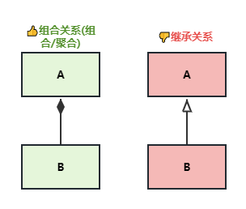
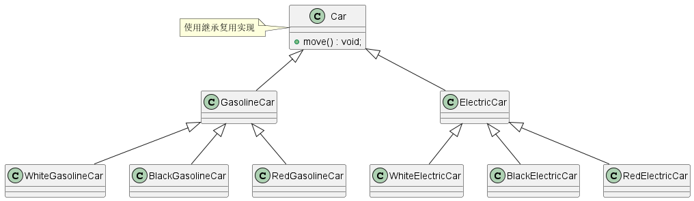
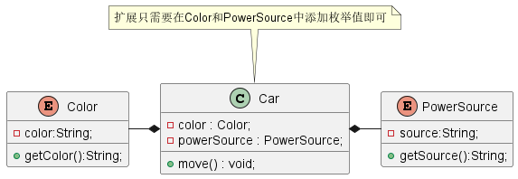

# 什么是合成复用原则？

**合成复用原则（Composite Reuse Principle，CRP）**又叫做 *组合/聚合复用原则（Composition/Aggregate Reuse Principle，CARP）*。*它要求在软件复用时，尽量使用 组合（has-a）/聚合（contains-a） 等关联关系来实现，尽量避免使用 继承（is-a）达到软件复用的目的*。

# 为什么使用合成复用原则？

继承复用的实现比较简单，因为父类的大部分功能都可以通过继承自动实现，但是继承复用也同样带来了一些问题：

1. *继承复用* 破坏了类的封装性，因为父类的实现细节暴露给了子类，父类对于子类而言是透明的，因此这种复用也被称为 *“白箱”复用*。
2. 子类和父类的耦合度很高，父类的任何实现变化都会导致子类实现发生变化，不利于类的扩展和维护。
3. *继承复用* 限制了复用的灵活性，因为从父类继承而来的实现是静态的，不可能在运行期间发生变化。

采用组合或聚合复用时，可以将已有对象纳入新对象中，使之称为新对象的一部分，新对象可以调用已有对象的功能达到复用的目的。它具有以下优点：

1. 维护了类的封装性，因为成员对象的内部细节对于新对象不可见，因此这种复用又被称为 *“黑箱”复用*。
2. 新旧类之间的耦合度低，新对象操作成员对象的唯一方法是通过操作成员对象暴露的接口。
3. 复用的灵活性高，这种复用可以在运行期间动态进行，新对象可以动态引用与成员对象类型相同的对象。

# 场景示例

汽车按“动力源”划分可分为汽油汽车和电动汽车，按“颜色”划分可分为白色汽车、黑色汽车和红色汽车等。如果同时考虑这两种分类情况，其组合就有很多种。按照继承关系实现就会产生很多子类，并且增加新的“动力源”或者“颜色”都要修改源代码，这违背了开闭原则。

如果改用组合关系就可以很好的解决以上问题，抽象出两个枚举类 `Color` 和 `PowerSource` 用于表示颜色和动力源，不仅可以任意扩展动力源和颜色，还减少了耦合度与不必要的类。其实现类图如下所示：

以上示例实现源码可见[合成复用原则示例代码](../../design-principle/design-crp/src/main/java/com/github/kokasumi)

# 总结

按照组合复用原则，我们在复用组件设计时，尽量使用组合/聚合关系进行复用，使用继承关系复用时，应该严格遵守里氏替换原则，必须满足 “IS-A” 关系的才能使用继承。

# 参考资料

1. [设计模式 ☞ 七大设计原则之合成复用原则](https://cloud.tencent.com/developer/article/1763395?from=article.detail.1922388&areaSource=106000.4&traceId=5njZFJpnD53FgmkibLBG3)
2. [软件修养 -- 组合/聚合复用原则（CARP：Composite/Aggregate Reuse Principle）](https://makeoptim.com/training/composite-reuse-principle/)

