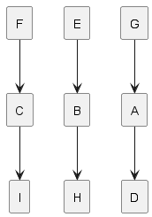
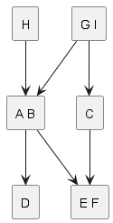
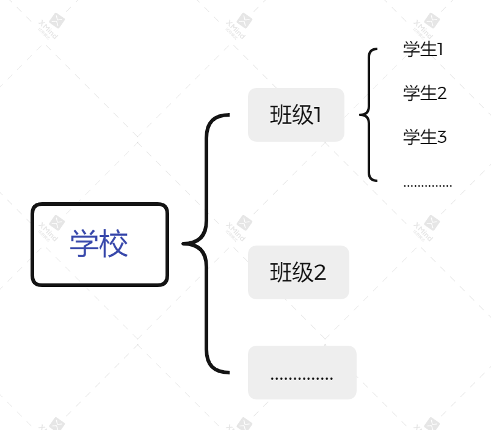
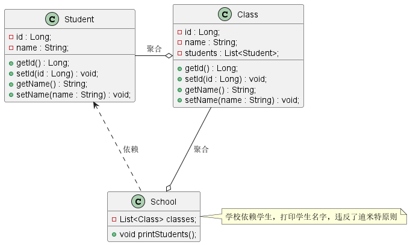
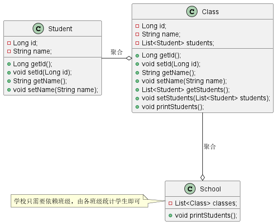

# 什么是迪米特法则？

**迪米特法则** （*Law of Demeter*，缩写为 *LOD*）也被称为 **最少知识原则**（*Least Knowledge Principle*，*LKP*），是一种软件开发的设计指导原则。其原始定义为：

> *Talk only to your immediate friends and not to strangers*。
>
> *只与你的直接朋友交谈，不跟陌生人说话。*

其含义为：**如果两个软件实体无需直接通信，那么就不应该发生直接的相互调用，可以通过第三方转发调用**。其目的是为了降低类之间的耦合度，提高模块的相对独立性。

# 为什么需要迪米特法则？

<table border="0.5" align="center">
  <tr>
    <th align="center"></th>
    <th align="center"></th>
  </tr>
</table>

从上图可以看出。*类与类之间的关系越密切，耦合度越高，当一个类发生改变时，对另一个类的影响也就越大，因此我们需要尽量减少每个类对其他类的依赖*。迪米特法则要求限制软件实体之间的通信宽度和深度，降低了类之间的耦合度，提高模块的相对独立性；耦合度降低，也提高了类的可复用率和系统的扩展性。

# 场景示例




比如说，我们需要打印出一个学校中的所有学生姓名，如果我们不遵守迪米特原则，可以使用以下设计来实现功能：



```java
class Student {
    private Long id;
    private String name;
    // 省略get/set方法
}

class Class {
    private Long id;
    private String name;
    private List<Student> students;
    // 省略get/set方法
}

class School {
    private List<Class>  classes;
    
    /**
    * 依赖Student类，破坏了迪米特原则
    */
    public void printStudents() {
        classes.forEach(aClass -> {
            // 打印班级名
            System.out.println(aClass.getName());
            // 打印学生名
            aClass.getStudents().forEach(student -> {
                System.out.println(student.getName());
            });
        });
    }
}
```

上述实现代码中， `School` 的设计违反了迪米特原则，`School` 与 `Student` 发生了直接关联。从逻辑上来讲，学校只需要知道有哪些班级，然后由各班级统计各自学生即可，因此 `School` 不应该与 `Student` 有任何关联。根据迪米特原则，可以讲代码修改如下：

```java
class Student {
    private Long id;
    private String name;
    // 省略get/set方法
}

class Class {
    private Long id;
    private String name;
    private List<Student> students;
    // 省略get/set方法
    
    public void printStudents() {
        students.forEach(student -> {
            System.out.println(student.getName());
        });
    }
}

class School {
    private List<Class>  classes;
    
    /**
    * 只需要依赖班级，不需要知道每个学生
    */
    public void printStudents() {
        classes.forEach(aClass -> {
            // 打印班级名
            System.out.println(aClass.getName());
            // 打印学生名
            aClass.printStudents();
        });
    }
}
```



# 总结

迪米特法则可以降低类之间的耦合度，提高模块的相对独立性。但是过度使用迪米特法则会使系统产生大量中介类，从而增加系统的复杂度，使得模块之间的通信效率降低。因此，在采用迪米特法则的时候需要反复权衡，在保证高内聚和低耦合的同时，也要保证系统的结构清晰。

# 参考资料

1. [得墨忒耳定律](https://zh.m.wikipedia.org/zh-hans/得墨忒耳定律)
2. [软件修养 -- 迪米特法则（LOD：Law Of Demeter）](https://makeoptim.com/training/law-of-demeter-principle)